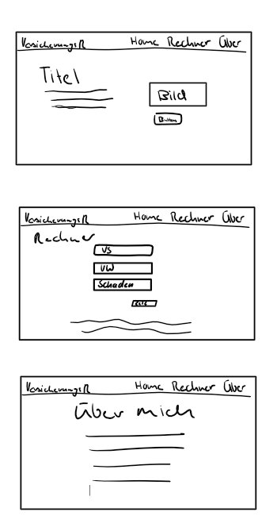

# Planung
Bevor ich angefangen habe zu programmieren, habe ich folgendes gemacht 
* Problem Statement
* User Story
* Key Screen
* System entwerfen

## Problem Statement
Das Problem Statement ist eine kurze, prägnante Aussage, die das Kernproblem oder die Herausforderung   
beschreibt, die gelöst werden soll, und den Kontext für die Lösung liefert. 

## User Story
Eine User Story ist eine kurze, prägnante Beschreibung aus der Perspektive eines Benutzers,  
die das Ziel, den Nutzen und die Anforderungen an ein Produkt oder eine Funktion in  
einem Satz zusammenfasst. 

## Key Screen
Ein Key Screen ist die Hauptansicht oder das zentrale Element einer Benutzeroberfläche, das die  
wichtigsten Informationen, Funktionen oder Interaktionen darstellt. 

## System entwerfen
Das System für meine Applikation, dass ich design habe sieht wie folgt aus. 

## Umsetzung & Reflexion
Die Umsetzung meines Projekts lief gut. Ich konnte alles so umsetzen wie ich es geplant hatte  
Ich habe mein Wissen in React nochmals verbessert und hatte die Möglichkeit Tailwind  
kennenzulernen. Was mich aber gestört hat ist, dass ich nicht noch mehr gemacht habe.  
Für mein nächstes Projekt möchte ich daher mehr Zeit investieren und mehr als nur das Minimum  
erfüllen.